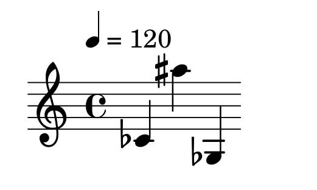
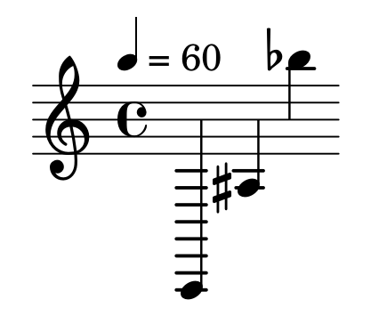
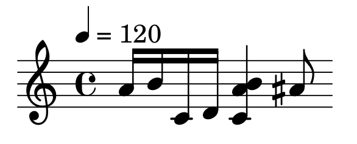
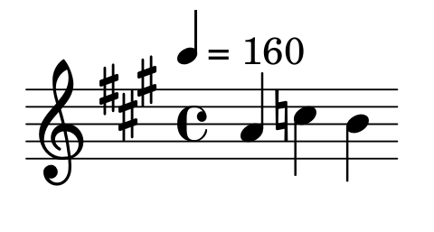
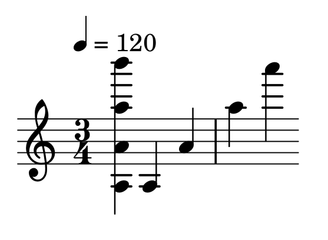
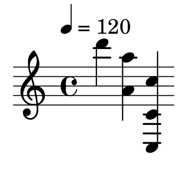

# Doble Intèrpret pel llenguatge musical JSBach

Aquest repositori mostra la resolució de la Pràctica de LP del curs 2021-2022 Q2, on s'implementa un doble intèrpret pel llenguatge de programació JSBach. En aquesta pàgina només es mencionaran parts tècniques de la implementació i les extensions realitzades, l'especificació bàsica del llenguatge es pot trobar en el directori [Enunciat](https://github.com/jayagarsi/Practica-LP/tree/master/Enunciat). La doble interpretació ve de primer interpretar el llenguatge JSBach i després generar codi en llenguatge [lillypond](https://lilypond.org/). Aquest README està pensat per explicar com s'ha implementat l'intèrpret.

## Execució de l'Interpret

Per cridar l'intèrpret, cal cridar a python de la següent manera:

```bash
python3 jsbach.py fitxer.jsb [nomfuncio] [parametres]
```
On jsbach.py és l'intèrpret del llenguatge, generat amb la comanda `antlr4 -Dlanguage=Python3 -no-listener -visitor $(grammar).g4` d'ANTLR. Per aquesta raó, per poder executar l'intèrpret cal tenir instal·lat python i ANTLR (aquest últim no fa falta doncs en el directori lib ja estan tots els fitxers necessaris per executar-lo, només seria necessari si es fes algún canvi en la gramàtica). La comanda té 3 paràmetres (a part de l'intèrpret i python3):

* **Nom del Fitxer**: tot i ser un llenguatge interpretat, l'intèrpret no permet execució interactiva, només llegeix programes de fitxers i cal que aquests tinguin l'extensió jsb.
* **Nomfuncio**: serveix per donar el nom de la primera funció que es vol executar. Si no es posa cap s'executa per defecte el Main (si n'hi ha)
* **Parametres**: parametres de la funcio que es vulgui cridar en cas que es posi el nom de la funció. Si no són correctes sortirà un error

## Classes utilitzades

Abans d'entrar en l'explicació de la gramàtica i dels visitadors de l'arbre cal entendre quines classes he creat per fer l'intèrpret i perquè.

### TreeVisitor

Principal classe on hi han tots els visitadors. Hereda de la classe que ANTLR genera que es diu jsbachVisitor.py, per a poder re-implementar els visitors que calgui. Els que no s'han reimplementat és perquè la implementació donada ja val.

### jsbachExceptions

Classe utilitzada per generar les meves pròpies excepcions quan es troba algún error en temps d'execució. Aquesta simplement genera el missatge "ERROR" més el missatge que se li passi per paràmetre des del visitor. Hereda de la classe Exception, i com a tal, al rebre qualsevol error s'abortarà l'execució. Com és un intèrpret aquest comportament ja és l'esperat.

```python
class jsbachExceptions(Exception):
    def __init__(self, message):
        self.message = "ERROR: " + message
```

### jsbachFunctionInfo

Aquesta classe realment no és necessària, però he pensat que una manera fàcil de emmagatzemar la informació dels procediemnts era fent una classe auxiliar que té tres atributs només: el nom de la funció, el context dels paràmetres de la funció i el context dels statements de la funció. Com ja he dit, no hauría fet falta fer una classe però penso que fa el codi més llegible.

```python
class jsbachFunctionInfo():
    def __init__(self, name, params, context):
        self.name = name
        self.params = params
        self.context = context
```

### MyErrorListener

La segona classe és la MyErrorListener que simplement s'usa per aturar l'execució quan es troben errors sintàctics o lèxics. Si hi ha errors sintàctics no té sentit seguir amb l'execució del programa doncs l'interpretació fallarà i per tant és més pràctic aturar l'execució.

```python
class MyErrorListener(ErrorListener):
    def syntaxError(self, recognizer, offendingSymbol, line, column, msg, e):
        print("ERROR: there are some syntactical or lexical errors")
        sys.exit()
```
Per terminar l'execució al script principal l'únic que cal afegir és la comanda `parser.addErrorListener(MyErrorListener())` i d'aquesta manera antlr ja s'encarregarà de cridar a MyErrorListener quan es trobi errors sintàctics o lèxics.

```python
input_stream = FileStream(sys.argv[1])

lexer = jsbachLexer(input_stream)
lexer.addErrorListener(MyErrorListener())
token_stream = CommonTokenStream(lexer)
parser = jsbachParser(token_stream)
parser.addErrorListener(MyErrorListener())
```
### CodeAndAudioGenerator

La última classe auxiliar que he creat és la que genera el codi en lilypond, amb el qual ja es podrà generar la partitura en pdf i la seva interpretació en wav i mp3. Per separar entre la generació de codi i el visitor en sí, he fet que el TreeVisitor desi en un string totes les notes que han de ser tocades. D'aquesta manera, primer es parseja tot el programa, s'interpreta i un cop ha acabat, se li passa aquest string al CodeAndAudioGenerator que escriurà el fitxer lilypond amb el que calgui. Si no s'ha tocat cap nota, no es generarà cap fitxer lilypond. Com la pràctica també incorpora extensions, aquesta classe rep més coses a part de les notes a tocar, com el tempo de la negra, l'armadura, etc. No ho he mencionat, però la classe TreeVisito té métodes per poder obtenir tots aquests strings necessaris per generar el codi.

```python
visitor.visit(tree)
notesString = visitor.getNotesString()
if notesString == "":
    print("Not generating any midi, wav or mp3 file as there is no song to play")
else:
    fileName = os.path.basename(programName)
    n = len(fileName) - 4
    fileName = fileName[0:n]

    tempo = visitor.getNotesTempo()
    key = visitor.getKeySignature()
    compas = visitor.getCompasTime()

    codeGen = CodeAndAudioGenerator(fileName, notesString, tempo, key, compas)
    codeGen.executeFileCreation()

```

## Gramàtica de JSBach

La gramàtica pel llenguatge segueix la mateixa estructura que la proposada en l'enunciat, a diferència de les extensions fetes de les que parlaré més endavant. Aquesta es divideix bàsicament en 4 blocs diferents: regles pels procediments, regles per les instruccions, regles per les expressions i tokens del llenguatge. Per mirar de reduïr l'extensió dels visitadors de l'arbre de sintaxis abstracte, he fet la gramàtica molt modular, generant noves regles per relegar i reduir la quantitat de feina per visitador. La gramàtica es pot consultar [aquí](https://github.com/jayagarsi/Practica-LP/tree/master/src/jsbach.g4).

## Visitadors de l'arbre

Pels visitadors de l'arbre he seguit l'esquema dissenyat en la gramàtica. Tots els detalls es poden veure en el codi. El que crec que és important fer-hi incís és en la codificació i decodificació de les notes. 

## Errors que s'han tingut en compte

Per aquesta pràctica no s'ha fet cap comprovació de tipus, per facilitar la feina, però sí he tingut en compte alguns errors que poden ocòrrer en temps d'execució. Amb la classe `jsbachExceptions` he generat tots els següents errors:
* **Múltiple declaració de funcions amb mateix nom**
* **Execució de programa amb una funció que no existeix**: salta quan a l'intèrpret se li passa un nom de funció que no existeix en el programa
* **Execució de programa sense Main**: salta quan al programa no se li passa cap nom de funció i no té Main
* **Paràmetres incompatibles**: salta quan en una crida a funció es passen un nombre de paràmetres incorrecte
* **Paràmetres formals repetits**: salta quan una funció té més d'un paràmetre amb el mateix nom
* **Acces inexistent a array**: salta quan s'accedeix a una posició inexistent d'un array
* **Tempo incorrecte**: salta quan es dona un valor de temps que no té senti musicalment
* **Nota no es pot tocar**: salta quan s'intenta tocar una nota que té un valor fraccional diferent als estipulats (veure extensió accidentals)
* **Esborrar posició inexistent d'array**
* **Índex negatiu en accés a array**: salta quan l'índex de l'array passat és negatiu.
* **Divisió per zero**: salta quan s'intenta dividir o fer el mòdul per 0
* **Mida d'una variable que no és llista**
* **Domini variable random mal definit**
* **Crida a funció inexistent**

## Extensions

En aquest apartat entraré més en detall en totes les extensions que he realitzat per millorar el JSBach ja donat i aconseguir un llenguatge més expressiu.

### Operacions booleanes

La primera extensió afegida a la pràctica és la possibilitat de tenir operacions booleanes com l'AND, l'OR i el NOT. Com George Boole és molt posterior a Bach, el concepte de booleà no existía però calia representar condicios lògiques igualment, com `a == 4 and b > 2`. D'aquesta manera, per implementar això, el llenguatge bach incorpora les mateixes operacions però amb els noms en alemany (doncs és com Bach li hauria dit). La notació es pot veure en el següent codi:

```   
~~~ prova_extensio_02.jsb ~~~

if nicht b |:
    <!> "Variable b es falsa"
:|

if a und b |:
    <!> "Les dues variables son certes"
:|

if a oder b |:
    <!> "Alguna de les variables es certa"
:|
```
L'equivalència amb Boole sería la següent:
    
| **Boole** | **JSBach** |
|-----------|------------|
| and       | und        |
| or        | oder       |
| not       | nicht      |

Tal i com ve especificat en el llenguatge, no hi ha valors booleans però 0 és fals i qualsevol altra cosa és cert.

### Nombres i Operacions amb Reals

La següent extensió ha sigut més aviat necessària per poder realitzar sostinguts i bemols, doncs facilita molt la feina. No hi ha molt a dir, la notació és la típica de qualsevol llenguatge, un valor enter seguit d'un punt i un valor fraccionari:

```
~~~ Prova Extensio 06 ~~~

Main |:
  a <- 3.43
  b <- 5.11
  <!> a+b           ~~~ la sortida es 8.54 ~~~
:|

```

El tractament dels floats no és especial, ara en comptes de tractar tots els valors com enters, s'ha de comprovar si el valor és un float, és a dir si té el mot conté un punt, i fer el cast implícit en cas que faci falta. Cal destacar que valors com 3.0 poden ser escrits però es tractaran com a floats igualment (tal i com fa Python).

### Nombres aleatòris

Per acabar amb les extensions menys musicals, parlaré de la generació de nombres aleatoris que dóna JSBach. Per generar un nombre aleatòri simplement s'ha d'escriure `random [ini end]`, on ini i end són l'interval en que es genera el nombre. Random és una expressió en JSBach, així que ha d'anar acompanyat d'un statement. Un codi d'exemple el podem veure en el següent:

```
~~~ Prova Extensio 09 ~~~

RandomAssign a |:
    while i <= 50 |:
        val <- random[3 12]
        a << val
        i <- i+1
    :|
    <!> a                   ~~~ genera una llista amb 50 nombres aleatoris entre 3 i 12 ~~~
:|
```
Cal destacar que el generador de nombres aleatòris només genera enters, i per tant els intervals també han de ser enters. Per evitar errors doncs, l'intèrpret comprova si els intervals són correctes. Els dos missatges d'error que s'emeten passen quan:
* Algun dels límits és un valor real (p.e. \[1.2, 3\])
* Els límits se sobreposen (p.e. \[3, 2\])

La generació del nombre aleatòri en si, l'he fet utilitzant la funció `randint` de la llibreria random de Python.

### Sostinguts i Bemols

Ara, podem començar amb les extensions musicals. La primera implementada és la possibilitat de tocar notes amb accidentals, siguin bemolls o sostinguts. La codificació per aquests m'ha portat bastants problemes, però al final he decidit codificar-ho en la pròpia nota. Aquí és on entren en joc els nombres reals. Abans que res, per escriure accidentals la nota ara anirà seguida d'un `#` o `b`. D'aquesta manera, les notes es poden esciure així ```A0# B2b C3```, etc. Si la nota no va seguida de res s'assumeix que és natural. Com el llenguatge està pensat per músics, he cregut que aquesta era la millor notació. Aquí hi tenim un exemple:

```
~~~ Prova Extensió 01~~~

Main |:
    <!> "Programa per sostinguts i bemols"
    a <- {C4b A5# G3b}
    <!> a
    <:> a
:|
```

Del qual la sortida en pdf és la següent:




Cal parlar una mica de la codificació amb més profunditat. Com els accidentals estan codificats en la pròpia nota, cal donar un valor nou a cada nota quan tinguem un sostingut o un bemoll. Per evitar complicacions, he seguit la següent notació:
* Si la nota té valor real i la part fraccional val 0.25 --> tenim un bemol
* Si la nota té valor real i la part fraccional val 0.75 --> tenim un sostingut
Aquesta notació és poc intuitiva, sobretot pels músics, però facilita molt la feina per part del compilador. D'aquesta manera al codificar la nota només cal fer el següent:

```python
...
accidentalToValue = {"#": 0.75, "b": 0.25}
...
if note[1] != "#" and note[1] != "b":
    offset = (int(note[1])-1)*7+2               # codificació normal d'una nota
else:
    acc = note[1]
    offset = 3*7+2 + accidentalToValue[acc]     # a la nota li afegim el valor accidental que correspongui
...
```

I a l'hora de decodificar:

```python
...
if isinstance(note, float):
    acc = note % 1
    # Tenim un bemol en la nota
    if acc == 0.25:
        note -= 0.25
        accidental = 'es'
    # Tenim un sostingut en la nota
    elif acc == 0.75:
        note -= 0.75
        accidental = 'is'
    else:
        msg = "Non playable note with value " + note
        raise jsbachExceptions(msg)
...

```

Com es pot veure, si el valor fraccionari no és ni 0.25 ni 0.75, s'envia un error de que aquella nota no es pot tocar. Per aquesta raó cal anar amb molt de compte a l'hora de tocar notes accidentades posant els seus valors numérics. La meva recomanació és deixar la feina bruta al compilador i escriure les notes amb la notació donada.

### Canvi de Tempo de la Negra (base)

Un altra extensió afegida important pels músics, és la possibilitat de canviar el tempo base de la negra. D'aquesta manera es pot canviar el ritme de tota la partitura de manera bastant fàcil. Per poder canviar el ritme, en el llenguatge s'haurà d'escriure `_tmp_ <- val`. És a dir que per canviar el ritme de la partitura simplement s'ha de fer una assignació normal però a una variable especial. He escollit dir-li així per separar el que poden ser identificadors d'aquesta variable especial. L'assignació es pot fer varies vegades en el codi, però només es pot quedar amb una i aquesta serà l'última que es faci. Per canviar el tempo en el lilypond el que s'ha de fer és afegir el següet dins de la part de l'absolute:

```
...
\tempo 4 = val
...
```
On 4 és el temps de la negra i val el ritme que se li assigni. Per defecte és 120. A més a més, es llençarà un error quan el ritme assignat tingui valor 0 o negatiu, doncs no té cap sentit musicalment. Sintàcticament es força que el valor assignat a `_tmp_` sigui un valor numéric, és a dir que no se li pot assignar una expressió, per evitar errors.


Per un exemple en JSBach:

```
~~~ Prova extensio 04 ~~~

Main |:
    _tmp_ <- 160
    <:> {C2 A3# B5b}
    <!> "Ritme val 160"
:|

```

I la sortida del pdf:



### Canvi de Tempo d'una Nota

Ara ve un altra extensió que també ha portat bastant temps, però que per generar partitures és imprescindible. JSBach també permet canviar el ritme de cada nota personalment. És a dir que ara podem definir rodones, blanques, negres, corxeres i semicorxeres. M'ha portat molt temps pensar la representació adequada i fàcil de manejar i al final he decidit codificar-ho en la pròpia nota també. Ara, a més de l'accidental i la octava, podem definir el ritme de la nota de la següent manera: ` A0#,4 B,1 C4b,2`. És a dir, que afegin una coma i un nombre ara canviarem el ritme de la nota. En lilypond, per declarar el tempo que té una nota simplement s'ha d'afegir un valor númeric al final d'aquesta (p.e. a'16 en lilypond seria la nota A4,8 en JSBach). El ritme i les notes es corresponen de la següent manera:

| ***Ritme***          | Rodona | Blanca | Negra | Corxera | Semicorxera |
|----------------------|--------|--------|-------|---------|-------------|
| ***Valor JSBach***   | 1      | 2      | 4     | 6       | 8           |
| ***Valor Lilypond*** | 1      | 2      | 4     | 8       | 16          |

D'aquesta manera amb la pròpia nota ja podem definir el tempo que tindrà, sense afegir res més. Per altra banda, la codificació de la nota es complica més. Per facilitar-ho, he decidit generar "nous" intervals, per les notes amb tempo. És a dir, les notes que siguin rodones en comptes de codificar-se de 0 a 52 es codificaran de 53 a 105. De manera general, per cada ritme el que faig és sumar-li 52+1 multiplicat pel tempo que tinguem, d'aquesta manera genero els "nous" intervals per cada ritme diferent. Abans d'entrar en la implementació, un exemple en JSBach seria el següent:

```
~~~ Prova Extensio 08 ~~~
Main |:
  a <- {A,8 B,8 C,8 D4 {A4 B4 C4}}
  <:> a
  <:> A4#,6
:|
```

I la sortida en pdf:



En quant a la implementació, el codi per codificar la nota sencera, quan té octava, accidental i tempo, és el següent:

```python
...
acc = note[2]
tmp = note[4]
offset = (int(note[1])-1)*7+2 + accidentalToValue[acc] + int(tmp)*53
...
```
I per decodificar:

```python
...
# La nota te un tempo concret
if note >= 53*8:
    note -= 53*8
    tempo = "16"
elif note >= 53*6:
    note -= 53*6
    tempo = "8"
elif note >= 53*4:
    note -= 53*4
    tempo = "4"
elif note >= 53*2:
    note -= 53*2
    tempo = "2"
elif note >= 53:
    note -= 53
    tempo = "1"
...
```

### Canvi d'Armadura

Una part molt important de les partitures també és el canvi d'armadura, que defineix les notes que han de ser sostingudes, bemoll o naturals. Per poder afegir una armadura, en JSBach s'ha d'escriure el següent `_ksg_ <- val`. La selecció del nom és per la mateixa raó que en el tempo general de la partitura. En aquest cas, els valors que pot prendre l'armadura són els que segueixen la següent estructura `('A' .. 'G') ('major'|'minor')`. És a dir podem tenir una nota seguida de major o minor depenent del que volem. En aquesta pàgina de la [wikipedia](https://en.wikipedia.org/wiki/Key_signature), hi ha més informació sobre com va la notació de l'armadura. Així doncs en JSBach:

```
~~~ Prova Extensio 05 ~~~

Armadura |:
    _ksg_ <- Amajor
    _tmp_ <- 160
    <:> {A4 C5 B4}
    <!> "Canviada armadura"
:|

Main |:
    Armadura
:|
```

Que en partitura es tradueix a:



L'armadura s'ha d'escriure tota junta, és a dir A major en JSBach serà Amajor, si no donarà error lèxic. Cal destacar que Lilypond tracta les armadures de manera estranya, en el sentit que et canvia l'armadura però les notes que haurien de ser sostingudes per exemple, les deixa naturals. Això és bastant estrany però és una decisió que Lilypond ha prés (sense molt de sentit).

 Per escriure això en Lilypond cal escriure `\key a \major` amb l'armadura que calgui. Com a exemple:

```
\version "2.20.0" 
\score {
   \absolute {
        ... 
        \key a \major
        ...
   } 
   \layout { } 
   \midi { } 
}
```

### Canvi de tempo del compàs

Pels músics també és molt important definir quan aba un compàs i quan comença l'altre, per mantenir la coherència en els tipus. Per fer això cal escriure el següent en JSBach `_cmp_ <- val`. Tal i com les anteriors extensions, `_cmp_` és un identificador especial per diferenciar-lo dels altres. El valor d'aquest ve marcat per la gramàtica i només pot ser el següent `('2' .. '8') '/' ('2'..'8')`. És a dir, el compàs més petit que es pot definir és el 2/2 i el més gran el 8/8. Aquesta decisió ha sigut totalment arbitrària en el disseny del JSBach, i ha sigut per poder marcar quins són els temps legals. D'aquesta manera evito que es puguin declarar coses errònies i m'estalvio feina de comprovació. A més a més, són valors amb sentit, doncs la gran majoria de partitures no superen els compassos de 4/4. Un exemple en JSBach:

```
~~~ Prova Extensio 07 ~~~

Main |:
  _ctm_ <- 3/4
  <:>  { {A A5 A3 B6} }
  <:> {A3 A4 A5 A6}
:|

```

Que en partitura:



Com ja he dit, si es posa un valor fora de l'interval declarat, es donarà error lèxic doncs està codificat en la pròpia gramàtica. Per traduïr-ho a Lilypond, cal escriure dins del bloc absolute `\time 3/4` com en el següent exemple:

```
\version "2.20.0" 
\score {
   \absolute { 
        \time 3/4
        ...
   } 
   \layout { } 
   \midi { } 
}
```
### Acords
 
Per acbar, l'última extensió que he implementat, ha sigut la possibilitat de tocar acords. La notació en JSBach per fer-ho, és fer una llista de llistes. És a dir: `{ A4 C5 {C3 C4 C1}}`, les notes `{C3 C4 C1}` s'interpretaran com un acord. JSBach permet definir múltiples llistes dins de llistes, però realment només s'interpretaràn com acords les llistes dobles, doncs no té sentit tocar l'acord d'un acord. Un exemple de codi en JSBach:

```

~~~ Prova Extensio 03 ~~~
Main |:
    a <- {D6 {A4 A5}}
    Acords a
    <:> {{C3 C4 C5}}
    <!> "Played some chords"
:|

Acords a |:
    <:> a
:|

```

Traduït a partitura:



Per definir els acords en Lilypond cal escriure les notes entre `<>`. D'aquesta manera l'acord `{{C4 D4 E4}}` es transforma en `<c' d' e'>`. Simplement, per tractar-ho en el TreeVisitor el que faig és comprovar si la llista passada té una llista dins o no. Si la té s'haurà de tocar un acord i si no una sola nota. Cal destacar un fet molt important relacionat amb l'extensió dels temps de cada nota. A un acord se li pot assignar un tempo concret, però cal tenir en compte varies restriccions que Lilypond posa:
* Les notes d'un acord tenen totes la mateixa durada (rodona, blanca, negra, corxera o semicorxera)
* Si en cada nota de l'acord s'hi codifica el tempo de l'acord, lilypond escull com a tempo de l'acord, el tempo de la primera nota.
* Per mantenir la coherència amb això, per defecte JSBach defineix el ritme dels acords a negra.


## Autor i Referències
Treball realitzat per Jaya García Fernández. Les referències per realitzar el treball han sigut principalment:
* Les transparències de l'assignatura: [https://gebakx.github.io/Python3/#1](https://gebakx.github.io/Python3/#1)
* Notació d'armadura: [https://en.wikipedia.org/wiki/Key_signature](https://en.wikipedia.org/wiki/Key_signature)
* Freqüències del piano: [https://ca.wikipedia.org/wiki/Freq%C3%BC%C3%A8ncies_del_piano](https://ca.wikipedia.org/wiki/Freq%C3%BC%C3%A8ncies_del_piano)
* Referència de Lilypond: [https://lilypond.org/manuals.es.html](https://lilypond.org/manuals.es.html)